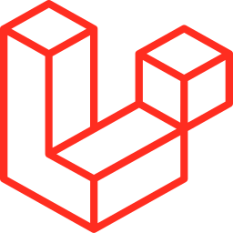
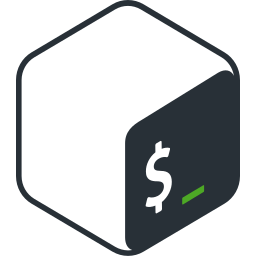
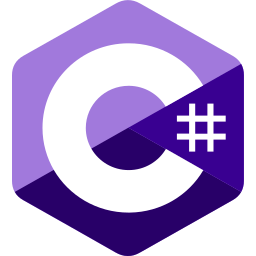

# 👋 Hey, I am [Quentin Lienhardt](https://cv.quentium.fr)!

I'm a 20 years old french 🇫🇷 developer, passionate about automation, software and web development.

<a href="https://github.com/QuentiumYT?tab=repositories">
    

        
    

    

        
    

    

        
    

    <!-- 

        
    
 -->
    <!-- 

        
    
 -->
    

        
    

</a>

## 🚀 Languages and tools:

| Key              | Value                                                     |
|------------------|-----------------------------------------------------------|
| Main languages   | <code></code> <code></code> <code></code> <code></code> <code></code> |
| Personal stacks  | <code></code> <code></code> <code></code> <code></code> <code></code> |
| Main frameworks  | <code></code> <code></code> <code></code> |
| Known frameworks | <code></code> <code></code> <code></code> |
| Syntax knowledge | <code> <code></code> <code></code> <code></code> |
| Storage          | <code></code> <code></code> <code></code> |
| Tools            | <code></code> <code></code> <code></code> <code></code> <code></code> <code></code> <code></code> |
| OS               | <code></code> <code></code> <code></code> <code></code> |

<!--
All these logos were taken from their official website or wikipedia.
I edited all of them to fit the viewbox, have the same size and a maximum compression. It was a lot of work.
-->

## 🔗 Social networks:

## 📌 Pinned repositories:

    
    
    
    
    
    
    
    
    
    

