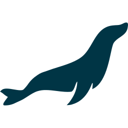
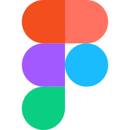

# 👋 Hey, I am [Quentin Lienhardt](https://cv.quentium.fr), also known as Quentium!

I'm a 23 years old french 🇫🇷 developer, passionate about automation, software and web development.

<a href="https://github.com/QuentiumYT?tab=repositories">
    

        
    

    

        
    

    

        
    

    

        
    

    

        
    

</a>

## 🚀 Languages and tools:

| Key              | Value                                                     |
|------------------|-----------------------------------------------------------|
| Main languages   | <code></code> <code></code> <code></code> <code></code> <code></code> |
| Main frameworks  | <code></code> <code></code> <code></code> <code></code> |
| Known frameworks | <code></code> <code></code> <code></code> |
| CMS knowledge | <code></code> <code></code> <code></code> |
| Used stacks  | <code></code> <code></code> <code></code> <code></code> <code></code> |
| Syntax knowledge | <code> <code></code> <code></code> <code></code> <code></code> |
| Storage          | <code></code> <code></code> <code> 1M lines"></code> |
| Tools            | <code></code> <code></code> <code></code> <code></code> <code></code> <code></code> <code></code> |
| OS               | <code></code> <code></code> <code></code> <code></code> |

<!--
The versions are the ones I'm using, most of them are latest assuming I'm having the latest features to work with.
-->

<!--
All these logos were taken from their official website or wikipedia.
I edited all of them to fit the viewbox, have the same size and a maximum compression.
-->

## 🔗 Social networks:

## 📌 Pinned repositories:

    
Linked projects with the library communicating with a Flask website (available on PyPI)

    
    
    

    
School projects for grade managements, V1 is a 100% custom code, V2 is made in Laravel

    
    
    

    
Bots for Discord, first is using the old command listener, the second is using the new API with slash commands

    
    
    

    
JavaScript library to handle cron tasks with a GUI (published on npmjs), the other is a registry for Docker images written in AngularJS

    
    
    

    
Big school projects, first is a full react app with a ton of Instagram like features, second is a custom PHP MVC for managing Need For Speed World cars

    
    

